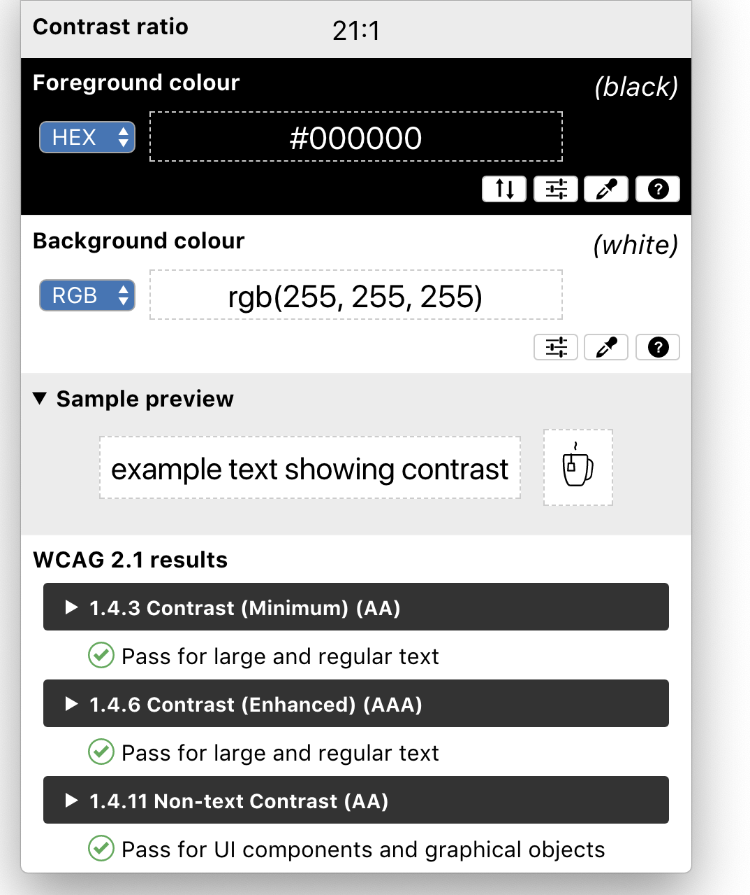

# Colour Contrast Analyser

The Colour Contrast Analyser (CCA) helps you determine the legibility of text and the contrast of visual elements, such as graphical controls and visual indicators.

This repository contains the source code for the new Colour Contrast Analyser (CCA) builds for Windows and MacOS based on [Electron](https://electronjs.org/). For the previous, non-Electron versions ("CCA Classic"), see the [CCA-Win](https://github.com/ThePacielloGroup/CCA-Win) and [CCA-OSX](https://github.com/ThePacielloGroup/CCA-OSX) repositories.

For further information, see [The Paciello Group's Colour Contrast Analyser resource page](https://developer.paciellogroup.com/resources/contrastanalyser/).

> This program is distributed in the hope that it will be useful, but WITHOUT ANY WARRANTY; without even the implied warranty of MERCHANTABILITY or FITNESS FOR A PARTICULAR PURPOSE. See the GNU General Public License for more details.

## Features
- WCAG 2.1 compliance indicators
- Several colour selector: Raw text entry, RGB sliders, Colour picker (Windows and MacOS only)
- Support for Alpha foreground transparency
- Colour Blindness simulator

## Known issues
- [Windows] Application menus aren't keyboard accessible (See #49)
- [Windows/MacOS] Zoom feature does't resize the application window (See #38)
- [Windows] Changing slider values is not announced in NVDA (See #37)

## Contributing
If you have an idea or if you found a bug, please submit a GitHub issue so that
we can track it.  Please search the existing issues before submitting to
prevent duplicates.

If you want to contribute, please send a pull request and someone will review your code. Please
follow the [Contribution
Guidelines](CONTRIBUTING.md)
before sending your pull request.

## Contact
If you ever have any questions, feel free to make an issue here on GitHub.  

## License
  

Colour Contrast Analyser (CCA) is Free Software: You can use, study share and improve it at your
will. Specifically you can redistribute and/or modify it under the terms of the
[GNU General Public License](https://www.gnu.org/licenses/gpl.html) as
published by the Free Software Foundation, either version 3 of the License, or
(at your option) any later version.